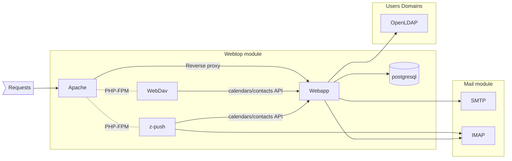

# ns8-webtop

NS8 WebTop module, a collaboration suite of services accessible via web for emails, calendars, contacts, documents.

Official website: http://www.sonicle.com/webtop

## Module overview



## Install

Instantiate the module with:

    add-module ghcr.io/nethserver/webtop:latest 1

The output of the command will return the instance name.
Output example:

    {"module_id": "webtop1", "image_name": "webtop", "image_url": "ghcr.io/nethserver/webtop:latest"}

## Custom Configuration

### `webtop.properties`

The `webtop.properties` configuration file for WebTop is generated by
expanding a text file template and is mounted by the `webapp` container.
The template consists of file fragments located under
`templates/webtop.properties.d/`. These fragments are concatenated and
written to the resulting file in alphabetical order according to their
directory names.

During the template expansion, placeholders for environment variables are
replaced.

To override an existing template fragment, follow this procedure:

    runagent -m webtop1
    # working directory switches to webtop1's state/ dir
    mkdir -p webtop.properties.d
    cp ../templates/webtop.properties.d/10builtin webtop.properties.d/10builtin
    vi webtop.properties.d/10builtin
    systemctl --user restart webtop

This procedure creates a directory for override fragments under the
module's `state/` directory and copies the original fragment into it. You
can then edit the copied fragment. Finally, restart the entire `webtop`
pod to apply the changes.

With similar commands, you can add custom fragments. Be careful not to
modify the contents of the `./templates` directory directly, as they will
be overwritten during the next application update. Files under
`./state/webtop.properties.d/` are retained and are also added to backup.

## Phonebook feature

The phonebook synchronization system allows you to manage contacts between
**WebTop** and a centralized **Phonebook**. This feature is supported by
scripts and timer-based systemd services for automation.

### Synchronization Scripts Overview

- **`webtop2phonebook.php`:**
   - Extracts contacts from WebTop.
   - Processes the contacts and removes pre-existing WebTop entries in the
     phonebook.
   - Inserts the cleaned and updated contacts into the phonebook database.

- **`pbook2webtop.php`:**
   - Extracts contacts from the phonebook database and import them
     inside a new `Rubrica Centralizzata` category for the user named `Bultin administrator user`
     (usually `administrator` for NS8 and `admin` for installations migrated from NS7).
     To change the user, you must specify the `PHONEBOOK_WEBTOP_ADMIN` inside the `phonebook.env` file.
     To change the category name, you must specify the `PHONEBOOK_WEBTOP_FOLDER` inside the `phonebook.env` file.
   - Cleans up the WebTop contacts folder and replaces its contents with
     updated contacts.

Both scripts use environment variables (`PHONEBOOK_DB_HOST`,
`PHONEBOOK_DB_PASSWORD`) for connecting to the databases. The sync process runs daily at 23:00.

To enable the synchronization, just set the name of a NethVoice instance in the `phonebook_instance` field
inside the `configure-module` API.


To force the synchronization:
```
runagent -m webtop1 systemctl --user start phonebook
```

### Debugging

To enable the debug mode, you must set the `DEBUG` variable inside the `phonebook.env` file:
```
runagent -m webtop1
echo DEBUG=1 >> phonebook.env
```

You can enter the phonebook container using:
```
podman run -ti --rm --env-file=./phonebook.env --pod=webtop --replace --name=phonebook-dev ${WEBTOP_PHONEBOOK_IMAGE} /bin/sh
```

## Uninstall

To uninstall the instance:

    remove-module --no-preserve webtop1

## Testing

Test the module using the `test-module.sh` script:


    ./test-module.sh <NODE_ADDR> ghcr.io/nethserver/webtop:latest

The tests are made using [Robot Framework](https://robotframework.org/)

## UI translation

Translated with [Weblate](https://hosted.weblate.org/projects/ns8/).

To setup the translation process:

- add [GitHub Weblate app](https://docs.weblate.org/en/latest/admin/continuous.html#github-setup) to your repository
- add your repository to [hosted.weblate.org](https://hosted.weblate.org) or ask a NethServer developer to add it to ns8 Weblate project
